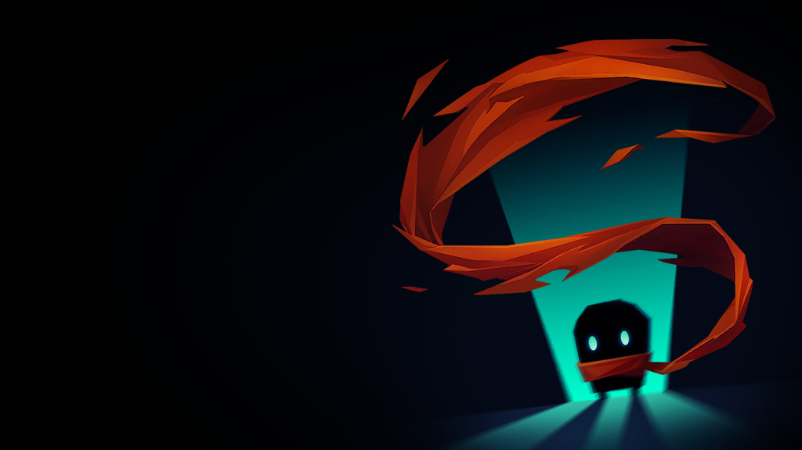

<h2 style='margin-top: 0;'>Soul Knight: WiiU Edition</h2>

<b>Soul Knight: WiiU Edition</b> — This is an unofficial/fan remake of the Android game Soul Knight. I'm making this project not to claim IP (intellectual property) for myself, but simply for fun. The project was originally planned for a PlayStation 3, PlayStation Vita, Old/New Nintendo 3DS, and Xbox 360 port. But I think it's better to just make a WiiU port for now. My overall goals are:

<ol>
  <li>Create a main menu through which you can enter the lobby</li>
  <li>Add Knight upgrades</li>
  <li>Make an endless levels</li>
  <li>Add more patterns for levels</li>
</ol>

<h3>What is Soul Knight?</h3>

Pixel roguelike RPG. Intriguing dungeon, crazy weapons, and endless adventure.
“In a time of gun and sword, the magical stone that maintains the balance of the world is stolen by high-tech aliens. The world is hanging on a thin thread. It all depends on you retrieving the magical stone…”
We honestly can’t keep making it all up. Let’s just shoot some alien minions!
This is the shooter game that features extremely easy and intuitive control. Its super smooth and enjoyable gameplay, mixed with rogue-like elements, will get you hooked from the very first run!

You can download it from: https://vlad-firesoft.itch.io/soul-knight-wiiu-edition

